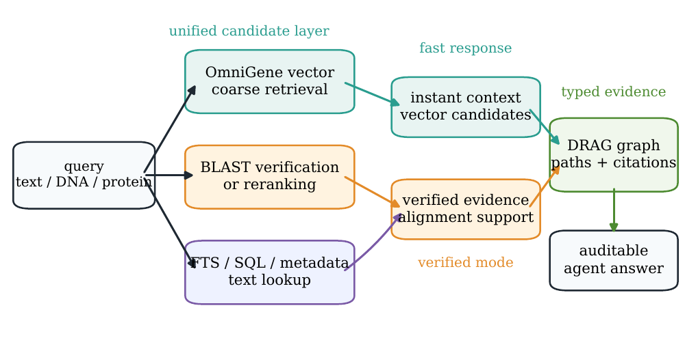
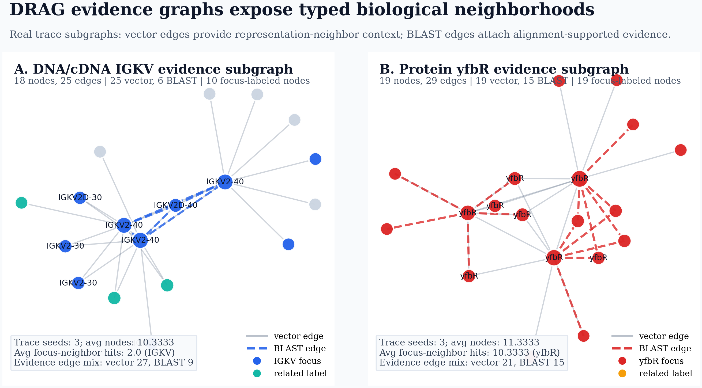
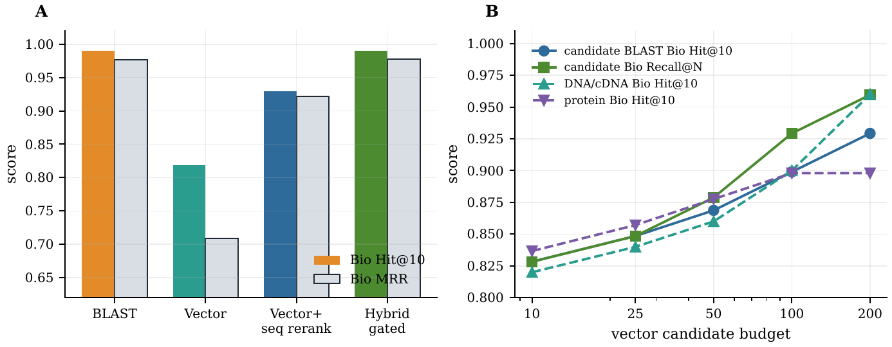
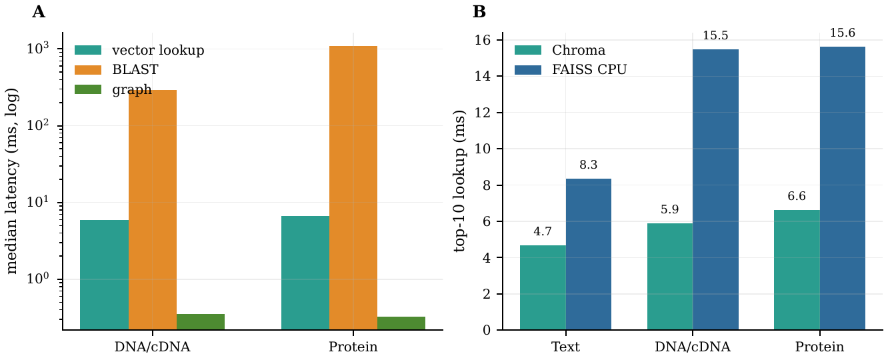
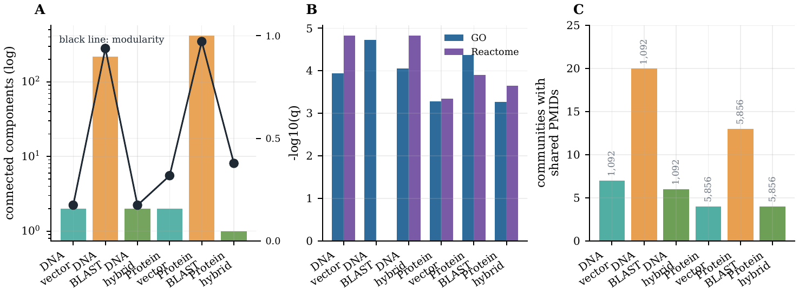

# BioRAG-DRAG

Repository: <https://github.com/maris205/biorag>

`dnarag` is a local-first biomedical RAG prototype for unified retrieval over
text, DNA/cDNA, protein sequences, mixed biological records, and graph evidence.
It combines vector candidate retrieval, BLAST verification, and DRAG
evidence-graph packaging for biomedical agents.

<p align="center">
  
</p>

The paper positioning is biological multimodal RAG, not replacing BLAST. BLAST
remains the alignment-grounded verification route; vector search provides a
unified candidate/context layer; DRAG packages retrieval results as typed,
inspectable evidence graphs.

## Highlights

- **Unified evidence interface:** SQL/FTS, Chroma vector retrieval, BLAST, and
  graph expansion expose one local retrieval API.
- **Model-agnostic embedding layer:** OmniGene CPT can serve mixed
  biological-language inputs; public encoders such as ProtT5 and ESM-2 can serve
  protein-only partitions.
- **Conservative sequence workflow:** vector search supplies candidate pools,
  while BLAST remains the verified route.
- **DRAG evidence graphs:** sequence hits are returned as typed neighborhoods
  rather than isolated ranked records.

<p align="center">
  
</p>

## Paper Snapshot

<p align="center">
  
  
</p>

Controlled Swiss-Prot parent-fragment scale frontier:

| Scale | BLAST Bio@10 / MRR | Vector Bio@10 / MRR | Vector Recall@200 | Candidate-BLAST Bio@10 / MRR |
| --- | ---: | ---: | ---: | ---: |
| 20k | 0.8560 / 0.8289 | 0.7780 / 0.7158 | 0.8460 | pending |
| 100k | 0.8320 / 0.7960 | 0.7260 / 0.6268 | 0.8000 | 0.7580 / 0.7245 |
| 300k | 0.8140 / 0.7613 | 0.6760 / 0.5788 | 0.7740 | 0.7320 / 0.6835 |

Candidate-BLAST improves dense retrieval ranking at matched scale, but the
current Chroma POC does not claim a speed advantage over full BLAST. The
candidate-BLAST-only stage is small; optimized vector serving is the next
systems step.

<p align="center">
  
</p>

## Repository Contents

- `dnarag/`: Python package and CLI.
- `scripts/`: dataset construction, vector builds, BLAST reranking, graph
  analysis, latency, and paper-summary scripts.
- `benchmarks/`: JSONL benchmark task definitions.
- `configs/`: local Standard KB, held-out subset, and model/backend configs.
- `docs/REPRODUCIBILITY.md`: paper-scale command list and artifact policy.
- `paper/main.tex` and `paper/main.pdf`: current manuscript draft.
- `reports/*.md`: compact experiment and research summaries.

## Quick Start

```bash
python -m dnarag.cli status --config configs/standard.yaml
python -m dnarag.cli search "BRCA1 DNA repair" --config configs/standard.yaml --limit 5
python -m dnarag.cli answer "BRCA1 DNA repair" --config configs/standard.yaml --limit 5
python -m dnarag.cli build-graph \
  --config configs/standard.yaml \
  --limit 0 \
  --reactome-edge-limit 0 \
  --skip-sidecars
python -m dnarag.cli search "BRCA1" --config configs/standard.yaml --use-graph --limit 5
```

By default, generated graph/vector artifacts are written under `indexes/standard/` in this repo.
The large Standard raw data and existing Open-Rosalind SQLite/BLAST indexes remain read-only inputs under `/autodl-fs/data/open-rosalind-kb/standard`.

Build a lightweight development vector index without model downloads:

```bash
python -m dnarag.cli build-vector \
  --config configs/standard.yaml \
  --backend hashing \
  --targets text \
  --limit 1000
```

For RAG POC work, import the generated embeddings into local persistent Chroma:

```bash
python -m dnarag.cli vector-db import --engine chroma --config configs/standard.yaml --targets text
python -m dnarag.cli vector-db status --engine chroma --config configs/standard.yaml
```

Chroma CRUD is available through `vector-db add`, `upsert`, `update`, `delete`, and `get`.
The lightweight SQLite/NumPy vector DB remains available as `--engine simple` for fallback and inspection.
Vector targets can include `text`, `protein_sequence`, `dna_sequence`, `protein_sequence_window`, `dna_sequence_window`, and `mixed`.
DNA and protein sequence queries prefer the window collections when those collections exist; use `--vector-target mixed` for explicit mixed English/sequence retrieval.

For paper-scale sequence retrieval experiments on a 96 GB GPU, use the BF16
merged CPT checkpoint as the main model:

```bash
bash scripts/download_omnigene_merged_autodl.sh
bash scripts/build_omnigene_merged_sequence_windows.sh protein_sequence_window,dna_sequence_window 10000 128 64 8
python -m dnarag.cli eval-search \
  --config configs/standard.yaml \
  --benchmark benchmarks/sequence_search.jsonl \
  --conditions blast,vector,hybrid_gated \
  --limit 10 \
  --output reports/sequence_window_eval.json
```

If the standard Hugging Face client stalls on large safetensors shards, use the
range-download fallback against `hf-mirror.com` for the missing file:

```bash
python scripts/download_hf_mirror_ranges.py \
  --repo dnagpt/OmniGene-4-CPT-v2-merged \
  --filename model-00006-of-00011.safetensors \
  --cache-dir /root/autodl-tmp/huggingface \
  --workers 16
```

Use transformers 4-bit as the low-memory efficiency baseline:

```bash
bash scripts/build_omnigene_4bit_sequence_windows.sh protein_sequence_window,dna_sequence_window 1024 128 64 1
python -m dnarag.cli eval-search \
  --config configs/standard_4bit.yaml \
  --benchmark benchmarks/sequence_search.jsonl \
  --conditions blast,vector \
  --limit 10 \
  --output reports/sequence_window_eval.json
```

The earlier 32 GB GPU could load the transformers 4-bit model, but observed
memory use was about 28 GB and part of the model was CPU-offloaded. The
`dnagpt/OmniGene-4-CPT-v2-merged` BF16 model should be the primary paper model
on the RTX PRO 6000 96 GB machine; 4-bit and GGUF are retained as efficiency and
engineering baselines.

Build a DRAG answer context without calling an external LLM:

```bash
python -m dnarag.cli answer \
  "BRCA1 DNA repair" \
  --config configs/standard.yaml \
  --modes fts,graph,vector \
  --limit 8
```

The output includes an extractive local answer scaffold, citation IDs, graph paths, modality views, the retrieval trace, and a generation prompt that can be handed to a local Gemma/Open-Rosalind agent.

Build a text-style DRAG view graph from a Chroma collection:

```bash
python -m dnarag.cli build-view-graph \
  --config configs/standard.yaml \
  --target protein_sequence \
  --limit 1000 \
  --neighbors 5
```

This POC graph deliberately uses only vector-neighbor evidence. Biological edges from BLAST, domains, motifs, or curated databases can be added later as ablations, which makes it easier to test whether biological structure emerges from the sequence/text representation itself.

Run the basic retrieval comparison against traditional local methods:

```bash
python -m dnarag.cli eval-search \
  --config configs/standard.yaml \
  --benchmark benchmarks/basic_search.jsonl \
  --conditions classical,vector,drag,hybrid \
  --limit 10 \
  --output reports/basic_search_eval.json
```

`classical` is FTS + BLAST, `vector` is OmniGene + Chroma, `drag` is FTS-seeded graph expansion, and `hybrid` combines all routes. The benchmark file is JSONL so new gene, pathway, protein-sequence, DNA-sequence, and mixed-modality tasks can be added without changing code.
Use `hybrid_gated` for the practical system condition: pure sequence queries run
BLAST + vector, while natural-language queries run FTS + graph + vector.
The current classical sequence baseline uses Swiss-Prot BLASTP for proteins and Ensembl cDNA BLASTN for DNA/cDNA.
Rebuild the cDNA BLASTN index with:

```bash
bash scripts/build_ensembl_cdna_blastn.sh
```

After installing FAISS GPU, benchmark vector lookup separately from query
embedding:

```bash
python scripts/benchmark_faiss_lookup.py \
  --config configs/standard.yaml \
  --target protein_sequence_window \
  --limit 100000 \
  --queries 5000 \
  --top-k 10 \
  --batch-size 256 \
  --gpu
```

Generate and run a larger strict-ID sequence-window sanity benchmark:

```bash
python scripts/make_sequence_window_benchmark.py \
  --config configs/standard.yaml \
  --output benchmarks/sequence_search_100.jsonl \
  --per-modality 50 \
  --seed 20260515

HF_HUB_OFFLINE=1 TRANSFORMERS_OFFLINE=1 DNARAG_EMBED_MAX_LENGTH=512 \
python -m dnarag.cli eval-search \
  --config configs/standard.yaml \
  --benchmark benchmarks/sequence_search_100.jsonl \
  --conditions blast,vector,hybrid_gated \
  --limit 10 \
  --output reports/sequence_window_bf16_100k_100query_eval.json \
  --summary-only \
  --progress
```

Enable the experimental sequence-aware vector reranker:

```bash
DNARAG_VECTOR_SEQUENCE_RERANK=1 \
HF_HUB_OFFLINE=1 TRANSFORMERS_OFFLINE=1 DNARAG_EMBED_MAX_LENGTH=512 \
python -m dnarag.cli eval-search \
  --config configs/standard.yaml \
  --benchmark benchmarks/sequence_search_100.jsonl \
  --conditions vector \
  --limit 10 \
  --output reports/sequence_window_bf16_100k_100query_vector_rerank_eval.json \
  --summary-only \
  --progress
```

Analyze and visualize the pure vector-neighbor DRAG view graphs:

```bash
python scripts/analyze_view_graph.py \
  --graph indexes/standard/graph/views/dna_sequence_window_1k.sqlite \
  --config configs/standard.yaml \
  --output-dir reports/figures \
  --prefix dna_sequence_window_1k
```

The generated HTML/SVG figures and community summaries are documented in
`reports/drag_view_graph_visualization.md`.

Build the intended OmniGene vector index when dependencies, GPU memory, and model access are available.
For the downloaded GGUF checkpoint, use the Clash/proxy download script once, then build vectors from the local `.gguf` file:

```bash
bash scripts/download_omnigene_gguf_clash.sh
bash scripts/build_omnigene_gguf_vectors.sh text 1000
```

The generic AutoDL vector script now defaults to the full merged BF16 model:

```bash
bash scripts/download_omnigene_merged_autodl.sh
bash scripts/build_omnigene_vectors_autodl.sh text 1000
```

The older transformers/bitsandbytes path is still available as a low-memory
engineering baseline. On AutoDL, use the proxy script below so Hugging Face
downloads go through `/etc/network_turbo`:

```bash
bash scripts/download_omnigene_4bit_autodl.sh
MODEL_ID=dnagpt/OmniGene-4-CPT-v2-4bit DTYPE=auto bash scripts/build_omnigene_vectors_autodl.sh text 1000
```

## References In Workspace

- `init.md`: project design brief.
- `open-rosalind-paper.pdf`: tool-first biomedical agent paper.
- `omnigene4.pdf` and `supplementary.pdf`: OmniGene-4 paper and supplementary material.
- `open-rosalind/` and `omnigene4/`: downloaded upstream project source.

See `docs/ARCHITECTURE.md`, `docs/DATA.md`, and `docs/EVALUATION.md` for the initialized plan.
See `docs/REPRODUCIBILITY.md` for the paper-scale command list and the tracked
versus regenerated artifact policy.
